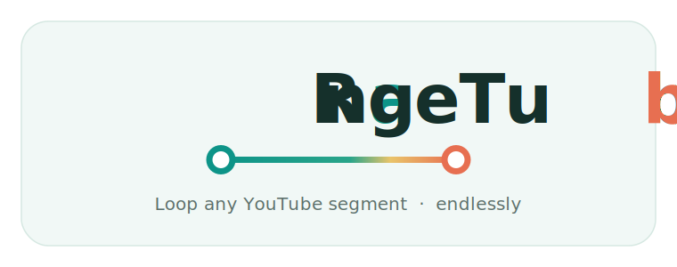

<div align="center">



<p>
  <strong>Free, backendless YouTube segment looper.</strong><br />
  Paste a video URL, pick a start/end range, loop that clip endlessly.<br />
  No ads. No signup. Just the clip and you.
</p>

<p>
  
  
  
  
  
</p>

</div>

---

## Quick start

> **Node 22** (`nvm use`) · **pnpm** via Corepack (`corepack enable`). Versions are pinned in `package.json`.

```bash
pnpm install
pnpm dev        # → http://localhost:4321
```

## Scripts

| Command           | What it does                  |
| ----------------- | ----------------------------- |
| `pnpm dev`        | Dev server                    |
| `pnpm build`      | Production build to `dist/`   |
| `pnpm preview`    | Serve the production build    |
| `pnpm test`       | Unit/component tests (once)   |
| `pnpm test:watch` | Tests in watch mode           |
| `pnpm typecheck`  | `astro check`                 |
| `pnpm lint`       | ESLint + Prettier check       |
| `pnpm format`     | Prettier write                |

## How it's built

**Astro** (static) with **Preact** islands · **TypeScript** (strict) · **Tailwind CSS v4** · **Vitest** + Testing Library. Ships zero-JS content pages and deploys static to **Cloudflare Pages**. No backend.

The playback spine is source-agnostic:

```
click-to-load facade  →  YT.Player  →  YouTubeSource ──┐
                                                       ├─ SourcePlayer
                       LoopEngine  ←──────────────────┘
              polls getCurrentTime(), seekTo()s back to range start
```

The looper is a single `client:idle` island (`src/components/Looper.tsx`); content pages stay zero-JS. Pure logic lives in `src/lib/`, UI in `src/components/`. New playback sources implement `SourcePlayer`, so the engine and UI never special-case YouTube.

## Contributing

TDD throughout: write the failing test first. See **[`AGENTS.md`](./AGENTS.md)** for the agent and project instructions.
